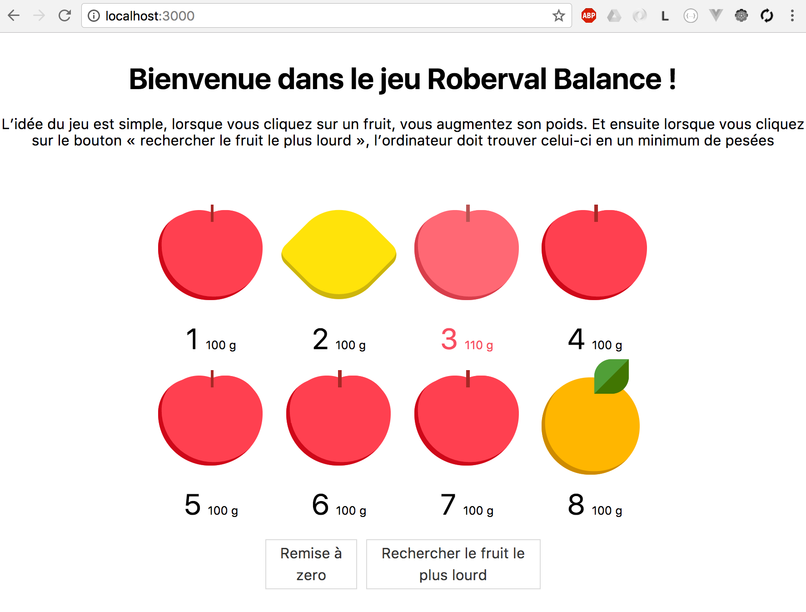
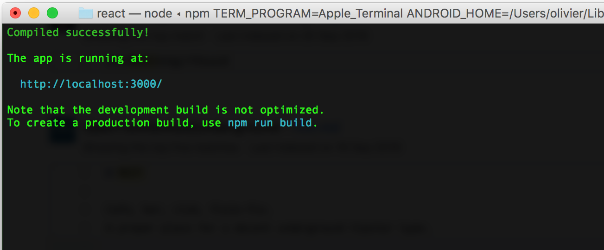
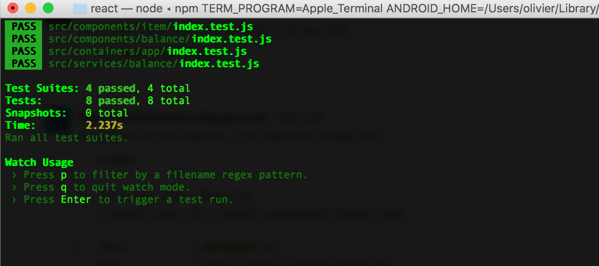

# Roberval Balance - ReactJS, Redux, Jest

## Requirements

    - nodejs
    - npm install -g react-scripts

## Quick start

    npm install
    npm run start

## Tests

    npm run test

## Contributing

If you like what you see, but want to add something more, fork this repo and add your additional feature to the name of the fork. Try to be specific with the name of your fork, listing the technologies used plus what features the fork adds.

## License

This software is released into the public domain.
